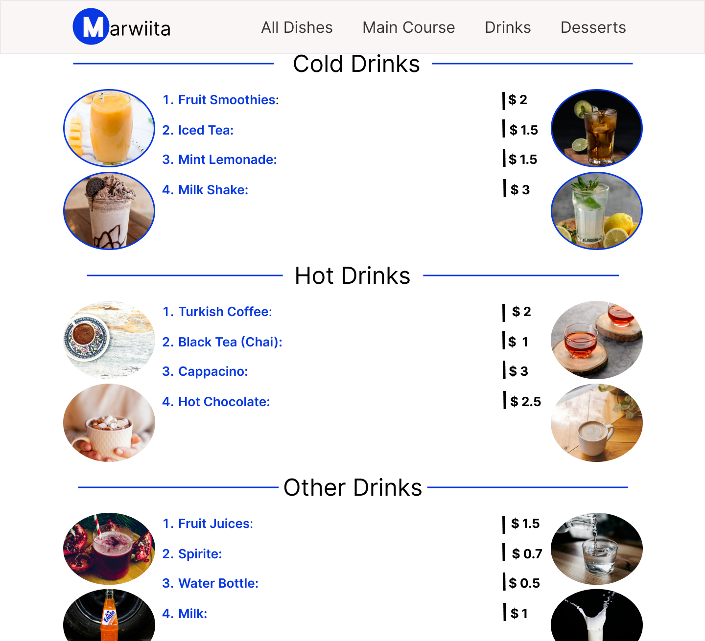

# Restaurant Menu UI/UX Design

.png)

The Restaurant Menu UI/UX Design project aims to create an intuitive and visually appealing menu interface for a restaurant's mobile application.

---

## Table of Contents

- [Preview](#preview)
- [Features](#features)
- [Design Screens](#design-screens)
- [How to Use](#how-to-use)
- [Contributing](#contributing)
- [License](#license)

---

## Features

- **Interactive Menu**: Users can easily navigate through different menu categories and items.
- **Visual Representation**: High-quality images and icons for each menu item to enhance user experience.

---

## Design Screens

### 1. Home Screen
.png)

### 2. Menu course

### 3. Drinks

---

## How to Use

To view the design screens and interact with the prototype:

1. Clone or download the repository to your local machine.
3. Navigate through different screens using the provided links or buttons.
4. Interact with the prototype as per the provided instructions.

---

## Contributing

Contributions are welcome! If you have any suggestions or improvements for the Restaurant Menu design, feel free to:

1. Fork the repository
2. Make your changes
3. Submit a pull request

For major design changes, please open an issue first to discuss your ideas.

---

## License

This project is licensed under the [MIT License](https://opensource.org/licenses/MIT).

---

## Acknowledgements

- [Figma](https://www.figma.com/) for providing a platform for designing and prototyping.
- [Unsplash](https://unsplash.com/) for high-quality images used in the design.
- [FontAwesome](https://fontawesome.com/) for icons used in the interface.

---

## Support

For support or inquiries, contact [your contact information] or open an issue on GitHub.
